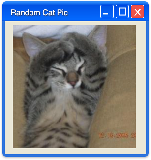
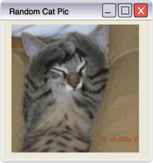
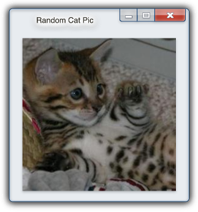
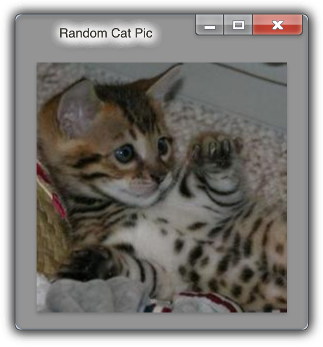

# OS-Window Web Component


> A web component (also known as custom element) based library which provides window decorations from the most common operating systems.

This HTML5 web component allows you to display **any HTML** in a operating system window on your web page. You can choose between **various operating systems** and themes (**dark mode**).

## Getting started

Choose any of the following methods to get started

### Install via node package manager

Run the following command in your command line to add os-window to your project
```shell
# for NPM
> npm install --save os-window

# for YARN
> yarn add os-window
```

### Include the module

Include the JavaScript module in your HTML page
```html
<script type="module" src="node_modules/os-window/main.js"></script>
```

Or import the module into your JavaScript code
```javascript
import 'os-window';
```

### Use the CDN

This project is also published to the CDN unpkg, which enables you to skip any local module installation when including this module in your webpage:

```html
<!-- Include specific version (recommended) -->
<script type="module" src="https://unpkg.com/os-window@0.2.3"></script>

<!-- Include latest version (not recommended) -->
<script type="module" src="https://unpkg.com/os-window"></script>
```

For more information have a look at the [Installation Guide](./doc/installation.md) or the detailled [documentation](./doc/index.md).
## Demo

Try the latest version of os-window online at <a href="https://bit.ly/39Yqb2d" target="_blank">https://bit.ly/39Yqb2d</a>!

## Examples

This example creates a non-interactive window with light macos theme
```html
<os-window
  window-title="Random Cat Pic"
>
  
</os-window>
```

The next example creates a fully interactive window with dark macos theme
```html
<os-window
  hover
  interactive
  os-theme="mac"
  theme="dark"
  window-state="maximized"
  window-title="Random Cat Pic"
>
  
</os-window>
```

Similarly, here are two examples creating windows with light and dark win-xp theme:

```html
<os-window
  window-title="Random Cat Pic"
  os-theme="win-xp"
>
  
</os-window>

<os-window
  window-title="Random Cat Pic"
  os-theme="win-xp"
  theme="dark"
>
  
</os-window>
```

Finally, here are two examples creating windows with light and dark win-7 theme:

```html
<os-window
  window-title="Random Cat Pic"
  os-theme="win-7"
>
  
</os-window>

<os-window
  window-title="Random Cat Pic"
  os-theme="win-7"
  theme="dark"
>
  
</os-window>
```







## Requirements

  - Browsers:
    - IE: not supported
    - Edge: Ver. >= 80
    - Firefox: Ver. >= 63
    - Chrome: Ver. >= 67
    - Safari: Ver. >= 10.1
    - Opera: Ver >= 41

## Features

- switch operating system designs
  - currently supported themes: `macos`, `win-xp`, and `win-7`
- switch between light &amp; dark themes
- create non-interactive or interactive window frames
- use any HTML as window contents
- fully scriptable interface
  - listen to events from the window
  - dynamically toggle any property (including design and theme)

## Documentation

Find more detailed information in the [documentation](./doc/index.md).

## Contributing
If you have any ideas, just [open an issue][issues] and tell me what you think.

If you find any bugs, just [open an issue][issues] and let me know. Or go right ahead and create a [pull request][pulls].

If you'd like to contribute, please fork the repository and make changes as
you'd like. Pull requests are warmly welcome.

## Licensing

This project is licensed under MIT license. You'll find a copy of the MIT license in the file [LICENSE](LICENSE).

[issues]:https://github.com/benjaminsattler/os-window/issues/new
[pulls]:https://github.com/benjaminsattler/os-window/pulls
