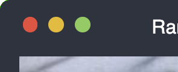
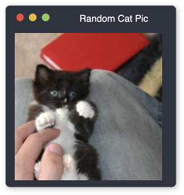
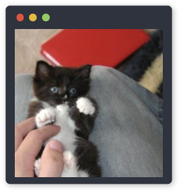
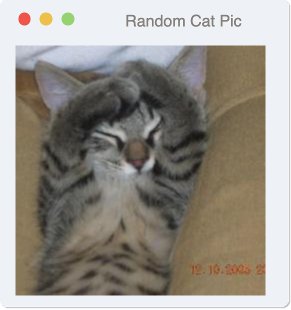
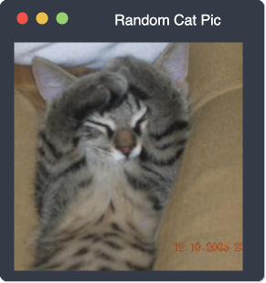

# API

## Mouse hover support

Allows to enable support for mouse hover events. This will cause the titlebar buttons to show a hover effect when the mouse cursor is hovering over any titlebar button. The specifics of the hover effect depend on the os-theme and theme used.

An example effect is shown in the images below:

(**left:** hover effect enabled, **right:** hover effect disabled (default)



```html
<!-- hover effect enabled -->
<os-window
  hover
></os-window>

<!-- hover effect disabled (default) -->
<os-window></os-window>
```

You can change the hover effect setting through JavaScript:
```javascript

var win = document.createElement('os-window');

// To enable the hover effect
win.hover = true;

// To disable the hover effect
win.hover = false;

// To read the state of the hover effect
var isHoverEnabled = win.hover;
```

You can also listen for changes to the hover effect setting by registering an event listener for the `hoverChange` event. The old and new values will be passed to the event listener as properties on the `e.detail` object:

```javascript
var win = document.createElement('os-window');
win.addEventListener('hoverChange', function(e) {
  // read the old value for the hover state
  console.log('Hover state was: ' + e.detail.oldValue);

  // read the new value for the hover state
  console.log('Hover state is now: ' + e.detail.newValue);
});
```

## Interaction support

Allows the user to modify the window state using their mouse. This will cause most of the titlebar buttons to respond to mouse clicks and perform the corresponding action: The maximize button will restore the window to its original size and the minimize button will cause the window to collapse to just its toolbar. The effect is the same as setting the `window-state` attribute or the `windowState` property to either `maximize` or `minimize`. For an example how either state looks like, please refer to the [Window State feature](#window-state)

```html
<!-- interaction support enabled -->
<os-window
  interactive
></os-window>

<!-- interaction support disabled (default) -->
<os-window></os-window>
```

You can change the interaction support setting through JavaScript:
```javascript

var win = document.createElement('os-window');

// To enable interaction support
win.interactive = true;

// To disable interaction support
win.interactive = false;

// To read the state of interaction support
var isInteractive = win.interactive;
```

You can also listen for changes to the interaction support setting by registering an event listener for the `interactionChange` event. The old and new values will be passed to the event listener as properties on the `e.detail` object:

```javascript
var win = document.createElement('os-window');
win.addEventListener('interactionChange', function(e) {
  // read the old value for the interaction support setting
  console.log('Interaction support was: ' + e.detail.oldValue);

  // read the new value for the interaction support setting
  console.log('Interaction support is now: ' + e.detail.newValue);
});
```

## Window State

You can change the state of the window from maximized (default) to minimized. A minimized window hides its contents and is reduced to its window titlebar, showing only the titlebar buttons and the title text.

An example of a maximized and minimized window is shown in the images below:

(**left:** maximixed (default), **right:** minimized




```html
<!-- window state maximized (default) -->
<os-window></os-window>

<!-- window state maximized (explicitly) -->
<os-window
  window-state="maximized"
></os-window>

<!-- window state minimized -->
<os-window
  window-state="minimized"
></os-window>
```

You can change the window state through JavaScript:
```javascript

var win = document.createElement('os-window');

// To change window state to minimized
win.windowState = 'minimized';

// To change window state to maximized
win.windowState = 'maximized';

// To read the window state
var windowState = win.windowState;
```

You can also listen for changes to the window state by registering an event listener for the `windowStateChange` event. The old and new state will be passed to the event listener as properties on the `e.detail` object:

```javascript
var win = document.createElement('os-window');
win.addEventListener('windowStateChange', function(e) {
  // read the old window state
  console.log('Window state was: ' + e.detail.oldWindowState);

  // read the new window state
  console.log('Window state is now: ' + e.detail.newWindowState);
});
```

## Window Title

You can change text that is displayed in the window titlebar next to the titlebar buttons. Per default the titlebar text is empty.

(**left:** empty titlebar text (default), **right:** random titlebar text




```html
<!-- window title text empty (default) -->
<os-window></os-window>

<!-- window title text empty (explicitly) -->
<os-window
  window-title=""
></os-window>

<!-- window title set -->
<os-window
  window-title="Random Cat Pic"
></os-window>
```

You can change the window title through JavaScript:
```javascript

var win = document.createElement('os-window');

// To change window title
win.windowState = 'My new window title';

// To read the window title
var windowTitle = win.windowTitle;
```

You can also listen for changes to the window title by registering an event listener for the `windowTitleChange` event. The old and new title will be passed to the event listener as properties on the `e.detail` object:

```javascript
var win = document.createElement('os-window');
win.addEventListener('windowTitleChange', function(e) {
  // read the old window title
  console.log('Window title was: ' + e.detail.oldWindowTitle);

  // read the new window title
  console.log('Window title is now: ' + e.detail.newWindowTitle);
});
```

## Operating System Theme

You can change the operating system theme of the window. Currently the only available operating system theme is "mac", which is also the default setting.

An example of all available operating system theme settings is show in the images below:

(**left:** mac window theme (default))


```html
<!-- default operating system theme -->
<os-window></os-window>

<!-- default operating system theme (explicit) -->
<os-window
  os-theme=""
></os-window>

<!-- mac operating system theme -->
<os-window
  os-theme="mac"
></os-window>
```

You can change the operating system theme through JavaScript:
```javascript

var win = document.createElement('os-window');

// To change operating system theme to mac
win.osTheme = 'mac';

// To read the operating system theme
var osTheme = win.osTheme;
```

You can also listen for changes to the operating system theme by registering an event listener for the `osThemeChange` event. The old and new operating system theme will be passed to the event listener as properties on the `e.detail` object:

```javascript
var win = document.createElement('os-window');
win.addEventListener('osThemeChange', function(e) {
  // read the old operating system theme
  console.log('Operating system theme was: ' + e.detail.oldOsTheme);

  // read the new operating system theme
  console.log('Operating system theme is now: ' + e.detail.newOsTheme);
});
```

## Theme

For each operating system theme you can also change light mode or dark mode.

An example of all available combinations of light and dark mode with operating system theme settings is show in the images below:

(**left:** light mac window theme (default), **right:** dark mac window theme)




```html
<!-- default theme -->
<os-window></os-window>

<!-- default theme (explicit) -->
<os-window
  theme="light"
></os-window>

<!-- dark theme -->
<os-window
  theme="dark"
></os-window>
```

You can change the theme through JavaScript:
```javascript

var win = document.createElement('os-window');

// To change the theme to 'light'
win.theme = 'light';

// To change the theme to 'dark'
win.theme = 'dark';

// To read the theme
var theme = win.theme;
```

You can also listen for changes to the operating system theme by registering an event listener for the `osThemeChange` event. The old and new operating system theme will be passed to the event listener as properties on the `e.detail` object:

```javascript
var win = document.createElement('os-window');
win.addEventListener('osThemeChange', function(e) {
  // read the old operating system theme
  console.log('Operating system theme was: ' + e.detail.oldOsTheme);

  // read the new operating system theme
  console.log('Operating system theme is now: ' + e.detail.newOsTheme);
});
```
